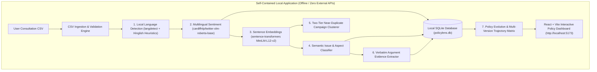

# Drishtikon (दृष्टिकोण)
### National Policy Consultation Analytics Platform · Ministry of Corporate Affairs

> **Portable local setup for compatible Windows/macOS/Linux systems.**  
> 100% offline, self-contained AI analytics platform with zero external cloud APIs or proprietary token requirements.

---

## 1. Quick Start (One Command)

### macOS / Linux:
```bash
# 1. Clone or extract project repository
git clone https://github.com/adarsh182/Drishtikon.git
cd Drishtikon

# 2. Run automated setup (creates virtualenv, installs deps, checks/caches models, seeds SQLite DB)
./setup.sh

# 3. Start local application stack (Backend on :8000, Frontend on :5173)
./start.sh
```

### Windows (cmd / PowerShell):
```cmd
# 1. Run automated setup
setup.bat

# 2. Start local application stack
start.bat
```

Once started:
- **Web Application UI**: [http://localhost:5173](http://localhost:5173)
- **FastAPI Interactive Docs**: [http://localhost:8000/docs](http://localhost:8000/docs)
- **Health Check Probe**: [http://localhost:8000/health](http://localhost:8000/health)

---

## 2. System Prerequisites & Hardware Profile

| Requirement | Specification |
| :--- | :--- |
| **Operating System** | macOS 12+, Ubuntu 20.04+, Debian 11+, Windows 10/11 |
| **Python Runtime** | Python 3.10, 3.11, 3.12, or 3.13 |
| **Node Runtime** | Node.js v18.0+ and npm v9.0+ |
| **System RAM** | 4 GB minimum (8 GB recommended for CPU inference) |
| **Disk Space** | ~2.5 GB total (codebase + dependencies + local PyTorch model weights) |
| **Network** | Internet required *only on first run* for Hugging Face model caching; 100% offline thereafter |

---

## 3. Local-First AI Architecture

Drishtikon runs **entirely on device** using local PyTorch / Hugging Face transformer models:



### Local AI Models & Roles:
1. **Multilingual Sentiment Transformer** (`cardiffnlp/twitter-xlm-roberta-base-sentiment-multilingual`):
   - 278-million parameter cross-lingual sequence classifier.
   - Evaluated across **11 Indian languages** (Hindi, Marathi, Gujarati, Bengali, Tamil, Telugu, Kannada, Malayalam, Punjabi, English) and Hinglish.
   - Steady-state CPU latency: **~15–25 ms per comment**.
2. **Multilingual Sentence Embeddings** (`sentence-transformers/paraphrase-multilingual-MiniLM-L12-v2`):
   - Dense 384-dimensional normalized vector representations for cross-lingual semantic matching.
3. **Language Detection & Code-Mixing**:
   - `langdetect` n-gram analyzer combined with heuristic regex indicators for Hinglish / Romanized Hindi (`mixed` / `unknown` support).
4. **Policy Aspect & Issue Taxonomy Intelligence**:
   - Cosine similarity matching against policy anchor embeddings (threshold $\ge 0.45$).
5. **Verbatim Argument Evidence Extractor**:
   - Preserves original sentences and salient clauses for complete analytical traceability.

---

## 4. Manual / Step-by-Step Setup

If you prefer starting backend and frontend manually in separate terminal windows:

### 🪟 Windows (Command Prompt / PowerShell):

**Terminal 1 — Backend (FastAPI + PyTorch + SQLite):**
```cmd
cd backend

:: 1. Create & activate Python virtual environment
python -m venv venv
venv\Scripts\activate

:: 2. Install backend dependencies
python -m pip install --upgrade pip
pip install -r requirements.txt

:: 3. Initialize SQLite DB, check/cache AI models, and seed demo dataset
python scripts\setup_local.py

:: 4. Launch FastAPI server
uvicorn app.main:app --port 8000
```

**Terminal 2 — Frontend (React + Vite):**
```cmd
cd frontend

:: 1. Install Node dependencies
npm install

:: 2. Start Vite frontend server
npm run dev
```

---

### 🍎 macOS / 🐧 Linux (Bash / Zsh):

**Terminal 1 — Backend (FastAPI + PyTorch + SQLite):**
```bash
cd backend

# 1. Create & activate Python virtual environment
python3 -m venv venv
source venv/bin/activate

# 2. Install backend dependencies
pip install --upgrade pip
pip install -r requirements.txt

# 3. Initialize SQLite DB, check/cache AI models, and seed demo dataset
python scripts/setup_local.py

# 4. Launch FastAPI server
uvicorn app.main:app --port 8000
```

**Terminal 2 — Frontend (React + Vite):**
```bash
cd frontend

# 1. Install Node dependencies
npm install

# 2. Start Vite frontend server
npm run dev
```

---

## 5. Benchmarking & Verification Suite

Drishtikon includes dedicated offline test suites for automated verification:

```bash
cd backend
source venv/bin/activate

# 1. Run Complete Automated Test Suite (20 tests: Config, Health, 4xx handling, Embeddings)
pytest tests/test_phase1_safe_cleanup.py -v

# 2. Run Multilingual 11-Language Live Inference Benchmark
python scripts/test_multilingual_model.py

# 3. Run Cross-Lingual Semantic Similarity & Vector Benchmark
python scripts/test_embeddings.py
```

---

## 6. Project Structure

```
Drishtikon/
├── setup.sh                 # One-command setup for macOS & Linux
├── start.sh                 # One-command application launcher (macOS & Linux)
├── setup.bat                # Windows setup script
├── start.bat                # Windows startup script
├── backend/
│   ├── app/
│   │   ├── api/             # FastAPI REST endpoints & error handling
│   │   ├── config.py        # Centralized typed thresholds & validation
│   │   ├── database/        # SQLite connection & idempotent migrations
│   │   ├── models/          # SQLAlchemy consultation & comment models
│   │   ├── schemas/         # Pydantic serialization schemas
│   │   └── services/        # Local AI pipelines (sentiment, embeddings, aspects)
│   ├── scripts/
│   │   ├── setup_local.py   # Automated pre-flight initialization & cache checker
│   │   ├── seed_demo.py     # Multilingual synthetic dataset generator
│   │   ├── test_multilingual_model.py # 11-language benchmark
│   │   └── test_embeddings.py         # Cross-lingual embedding benchmark
│   ├── tests/
│   │   └── test_phase1_safe_cleanup.py# Comprehensive pytest suite
│   └── requirements.txt     # Python dependencies
├── frontend/
│   ├── src/
│   │   ├── pages/           # Dashboard, Evolution, Issues, Comments, Upload
│   │   ├── services/api.ts  # Axios client with retry logic
│   │   └── types/           # TypeScript data interfaces
│   └── package.json         # React & Vite dependencies
└── README.md
```

---

## 7. Model Cache Management & Privacy

- **Cache Directory**: Models are automatically cached in your operating system's user directory (`~/.cache/huggingface/hub` on Unix, `%USERPROFILE%\.cache\huggingface\hub` on Windows).
- **Offline Guarantee**: Once downloaded during `./setup.sh`, the application operates **100% offline** without any internet connection.
- **Git Cleanliness**: Model binary weights and SQLite database files are excluded from version control via `.gitignore`.
