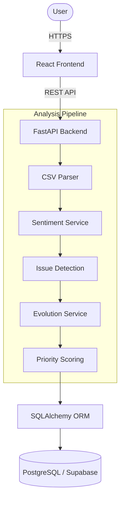

# Drishtikon
### MCA Policy Consultation Intelligence Platform

## 1. Overview

Ministries receive large volumes of unstructured consultation comments and need a faster, traceable way to understand sentiment, concerns, affected stakeholders, and whether later drafts address those concerns.

**Drishtikon** is an intelligent analytics platform that automates this entire lifecycle. The core workflow involves:

Public consultation CSV → comment validation → sentiment analysis → policy issue identification → stakeholder analysis → section mapping → evidence retrieval → policy evolution across drafts.

This project was built for the **Smart India Hackathon** (Problem Statement ID: SIH25034, Ministry of Corporate Affairs).

## 2. Key Differentiator

### Policy Evolution
The platform's primary strength is its ability to track "What changed after public feedback?". 
It provides a chronological view of issues across multiple consultation phases:
Draft v1 → Stakeholder feedback → Draft v2 → Stakeholder feedback → Draft v3

The system identifies:
- **Improved concerns**: Issues that received negative feedback initially but improved in sentiment in subsequent drafts.
- **Persistent concerns**: Issues that continue to draw negative feedback across multiple drafts.
- **Emerging concerns**: New issues that arise in later drafts that were absent previously.
- **Worsening concerns**: Issues where negative feedback increases over time.
- **Volatile/recovery trajectories**: Issues showing varied responses over the consultation lifecycle.

Every analytical claim is strictly backed by verbatim evidence traceability.

## 3. Features
- **CSV Upload**: Robust ingestion of consultation data.
- **Flexible CSV Column Detection**: Automatically maps standard and non-standard column headers (e.g. `true_clause`).
- **Invalid/Empty Row Filtering**: Silently drops malformed data without failing the entire batch.
- **Sentiment Analysis**: Predicts positive, negative, or neutral sentiment with confidence scores.
- **Policy Issue Classification**: Tags comments to specific policy domains using keyword taxonomies.
- **Stakeholder & Section Filtering**: Drill down analytics by stakeholder type or legal clause.
- **Policy Evolution Tracking**: Tracks changes in sentiment and volume over distinct policy versions.
- **Verbatim Evidence**: Direct drill-down from aggregated issues to the original comments.
- **Comment Search & Dataset Isolation**: Search capabilities within fully isolated consultation datasets.
- **Issue Priority Scoring**: Mathematically scores issues from 0-100 to prioritize analyst attention.
- **Evidence Sufficiency Indicators**: Flags sample sizes as INSUFFICIENT, LIMITED, or SUFFICIENT.
- **Responsive Dashboard**: Data visualization using React and Recharts.

## 4. Technology Stack
| Layer       | Technologies |
|-------------|--------------|
| **Frontend** | React, TypeScript, Vite, Tailwind CSS, React Router, Recharts, Axios |
| **Backend**  | Python, FastAPI, SQLAlchemy, Pydantic |
| **NLP**      | Hugging Face Transformers (`cardiffnlp/twitter-roberta-base-sentiment-latest`), Keyword/Rule Fallback |
| **Database** | PostgreSQL / Supabase (Production), SQLite (Local Development) |
| **Deployment**| Vercel (Frontend), Render (Backend), Supabase (Database) |

## 5. Architecture



## 6. Repository Structure
```
Drishtikon/
├── backend/
│   ├── app/
│   │   ├── api/          # FastAPI routes
│   │   ├── database/     # DB connections
│   │   ├── models/       # SQLAlchemy models
│   │   ├── schemas/      # Pydantic validation schemas
│   │   ├── services/     # Core business logic & NLP
│   │   └── utils/        # Parsers and helpers
│   ├── scripts/          # Demo seed scripts
│   ├── static/           # Static assets (demo CSV)
│   ├── requirements.txt
│   └── Dockerfile
├── frontend/
│   ├── public/           # Sample CSVs & icons
│   ├── src/
│   │   ├── components/   # Reusable UI elements
│   │   ├── context/      # React contexts
│   │   ├── pages/        # Route views
│   │   ├── services/     # API clients
│   │   ├── types/        # TypeScript definitions
│   │   └── utils/        # Formatting utilities
│   └── package.json
├── .env.example
├── .gitignore
└── README.md
```

## 7. Local Development

### Backend
Navigate to the `backend/` directory, set up your virtual environment, and run the FastAPI server:
```bash
cd backend
python -m venv venv
source venv/bin/activate
pip install -r requirements.txt
uvicorn app.main:app --reload
```
- API will run at: `http://localhost:8000`
- Interactive Swagger docs: `http://localhost:8000/docs`

### Frontend
Navigate to the `frontend/` directory, install dependencies, and run the Vite dev server:
```bash
cd frontend
npm install
npm run dev
```
- App will run at: `http://localhost:5173`

## 8. Environment Variables
To run this project, configure the following variables in a `.env` file (see `.env.example`). Do NOT commit real secrets.

**Backend (`backend/.env`)**
- `DATABASE_URL`: Connection string to PostgreSQL/SQLite
- `CORS_ORIGINS`: Allowed frontend origins
- `USE_ML_MODEL`: Set to `true` to enable Hugging Face Transformers
- `HF_TOKEN`: (Optional) Hugging Face Hub token to avoid rate limits

**Frontend (`frontend/.env`)**
- `VITE_API_URL`: Backend URL
- `VITE_API_TIMEOUT_MS`: Standard request timeout
- `VITE_UPLOAD_TIMEOUT_MS`: Extended timeout for CSV ingestion

## 9. CSV Upload Format
The ingestion pipeline is flexible and supports mapping aliases. Unknown columns are ignored. Malformed rows (missing text) are skipped without failing the entire batch.

**Required Fields (or aliases):**
- `text` / `comment` / `feedback`: The actual stakeholder comment.
- `stakeholder_type` / `stakeholder`: e.g. "Law Firm", "Citizen".
- `version` / `draft_version`: e.g. "v1", "v2" (normalized automatically).

**Optional Fields:**
- `true_clause` / `section` / `clause`: Specific legal section referenced.
- `language`: e.g. "english", "hinglish".
- `is_templated`: Boolean flag for bulk/spam comments.

**Example CSV:**
```csv
text,stakeholder_type,version,true_clause
"The penalty for late filing is too high.",Startup,v1,Section 14
"We agree with the new CSR reporting norms.",Law Firm,v2,Section 135
```

## 10. Analysis Pipeline
The backend executes a sequential analysis pipeline on ingestion:
1. **CSV Ingestion**: Receives the multipart file.
2. **Schema Detection**: Matches headers against known aliases.
3. **Row Validation**: Discards empty or fundamentally invalid rows.
4. **Normalization**: Standardizes versions (e.g. "Draft 1" -> "v1").
5. **Sentiment**: Analyzes text via Transformers (or keyword fallback) to yield polarity and confidence.
6. **Issue Tagging**: Applies taxonomy-based keywords to detect the primary issue (or tags "General Feedback").
7. **Database Persistence**: Stores all artifacts cleanly into relational tables.

Individual row failures will not crash the batch ingestion.

## 11. Priority Scoring
Issues are assigned a `Priority Score (0-100)` to highlight the most critical policy concerns for analysts. The mathematically robust formula weights:
- **30% Concern Magnitude**: Issue volume relative to the consultation total.
- **30% Negative Sentiment**: Density of negative feedback.
- **20% Stakeholder Breadth**: Diversity of unique stakeholder groups involved.
- **20% Policy Evolution**: Negative momentum across versions.

Categories:
- **HIGH**: >= 65
- **MEDIUM**: 40-64
- **LOW**: < 40

**Evidence Sufficiency**
To prevent small sample sizes from artificially inflating priority, issues are flagged with data sufficiency indicators:
- `< 10 comments`: INSUFFICIENT
- `10-29 comments`: LIMITED
- `>= 30 comments`: SUFFICIENT

## 12. Policy Evolution
Drishtikon analyzes issue trajectories over consecutive drafts (e.g. `v1 -> v2 -> v3`).
The system calculates absolute changes in volume and average sentiment. 
Note: The system identifies variations in stakeholder reception to specific policy issues over time, but it does *not* read amendment text to determine exactly *why* a policy changed. It relies purely on the quantitative shift in public feedback.

## 13. API
Key endpoints available on the FastAPI backend:
- `GET /health` : System health check
- `GET /consultations` : List all loaded consultations
- `POST /comments/upload` : Multipart form upload for CSV files
- `GET /dashboard/{consultation_id}` : Aggregated metrics for the dashboard
- `GET /issues/{consultation_id}` : List of priority-scored policy issues
- `GET /issues/{consultation_id}/{issue_name}` : Detailed issue metrics
- `GET /issues/{consultation_id}/{issue_name}/evidence` : Paginated verifiable original comments
- `GET /consultations/{consultation_id}/versions` : Version history breakdown

## 14. Demo Workflow
For a quick 2-minute evaluation:
1. Open the **Dashboard** to view sentiment distributions.
2. Locate the top policy concern tagged as **HIGH Priority**.
3. Click to open **Evidence** and verify the original stakeholder verbatim comments.
4. Open the **Policy Evolution** tab to see how a specific issue changed from `v1` to `v2`.
5. Navigate to **Upload**, drag and drop a new consultation CSV, and observe the real-time dataset analysis update.

## 15. Deployment
- **Frontend**: Deployed seamlessly on Vercel.
- **Backend**: Hosted on Render. Note: Free tier instances may spin down after inactivity, causing a brief "cold start" (up to 50 seconds) on the first upload request.
- **Database**: Fully managed PostgreSQL on Supabase.

## 16. Limitations
- **Sentiment Domain Limitations**: Indian-language and code-mixed (Hinglish) sentiment performance is currently a known limitation of the English-centric baseline model.
- **Issue Detection**: Currently relies on taxonomy/keyword matching rather than semantic embeddings.
- **Cold Starts**: Render free-tier deployments can experience cold starts.
- **Advisory Prototype**: This platform acts as an analytics co-pilot for policy analysts; it is not a legal decision-making system.

## 17. Future Improvements
- Integration of specialized Indian-language and code-mixed models (e.g. IndicRoBERTa).
- Semantic/embedding-based issue detection and clause mapping.
- Automated deduplication for identical templated campaigns.
- Exportable executive briefings and automated human-in-the-loop review queues.
